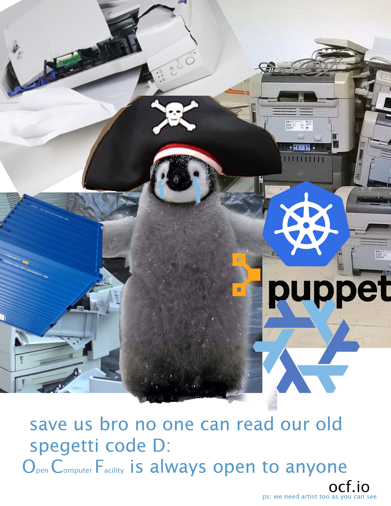
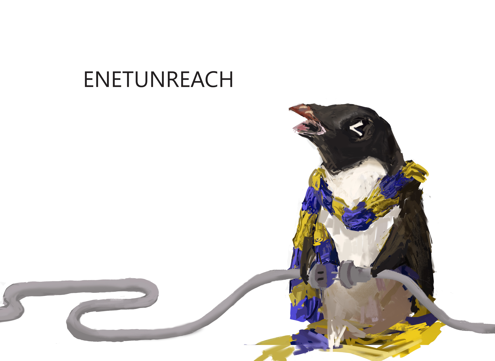

# 11 | 04/09/25

Directors in Attendance:

- [x] adi\*
- [x] adymchenko\*\*
- [x] aly
- [x] danliu
- [x] erdaifuu\*
- [x] fengyihuang (hyper super duper final ultimate ultra(lisk) coolest)
- [x] finwan
- [x] jaysa
- [x] jedakrisnell
- [x] jingwenyang
- [x] joiew
- [x] laksith
- [ ] lemurseven\*\*
- [x] lic
- [x] lukepeters
- [x] ncostello
- [ ] oliverni\*\*
- [x] rjz
- [x] ronitnath
- [x] rsang
- [x] sawansri\*
- [x] sbwilliams\*\*
- [x] storce
- [x] tabi
- [x] toke
- [x] msonmez

\*=missed last bod

Guests in Attendance:

* tiffanieguichard

Logistics:

Start time: approx. 18:15

Note taker: lukepeters, rjz

## Agenda

1. Voting matters:

   1. Large HDD purchase
   2. Constitution update
2. Requests for Agreement:

   1. Response to an ASUC office

## Items

### Voting

* Purchase of 2 new HDDs at $360/per to replace hard drives currently on warning
  * rjz: pricing currently higher than ideal
  * 18-0 approved
  * can discuss expanding student storage separately
* Constitution update to when nominations/removals from board take effect
  * Discussion of board attendance policy
  * fengyihuang: should have an official proposal for BoD directors to come up and nominate someone formally to the board, discuss, then vote
    * rather than just show up enough and then get implicitly nominated
    * I think directors should have made some sort of contribution to the OCF e.g. be part of staff
    * Just allow 2 unexcused absences per semester (i.e. without communicating before hand)
    * tabi: could be good to have a more flexible policy
    * laksith: bod shouldn't be taken too seriously. 90% should be discussed in GM. People outside BoD can still contribute without voting.
    * aly: bod is very self selective. people who commit to coming here every week
      * tabi: as in investment in OCF as an org
    * laksith: I was teaching the decal in the beginning but only joined bod when becoming decal head
    * joie: could streamline getting people back on bod after a leave of absence
    * jingwen: don't see why we need to go through the policy change
    * fengyihuang: would like to see bod better defined
    * lots of nuance to this conversation, let's pick it up later
  * Vote to remove oliverni and michael from BoD
    * They have indicated they no longer intend to continue being participating members
    * ronit: would like to call a vote anyway, though not technically required.
      * Passed, 17-0
* Xbox controller x1 staff benefit (we have an xbox and one controller) $50
  * multiple people can use rjz laptop at the same time
  * it'll be here for "perhaps a year".™️ perchance
  * laksith offers to donate a controller asw
  * no vote
* rjz is nominated for OCF Site Manager
  * 19 in favour, rjz is approved as SM

### Notification

#### Management

* University relations
* \
  * ASUC
    * Tldr: Senate office wants us to use the Ecosia browser
      * I hope this email finds you well. I am reaching out to you on behalf of the ASUC Office of Senator Chander where I serve as the Deputy Director of Environmental Justice and Sustainability. 

        Our office is exploring ways to promote sustainability across campus, and we were wondering if the OCF would consider setting **Ecosia** as the default browser on all OCF computers. Ecosia uses 100% of its profits to fund climate action projects, primarily tree planting efforts around the world. You can learn more about their work [here](https://companies.ecosia.org/universities). 
    * ~~Thoughts: Ecosia is not foss, and is not packaged for nix~~
      * ~~Proposed plan: offer to add it to our desktops when it becomes available for nix~~
      * rejected: browser not available on Linux - rjz
      * lukepeters: could still set default search engine to Ecosia. I wouldn't support changing the actual browser.
        * would like to put to a vote though -rjz
          * agreed -luke
        * ecosia in favor of google is fine -aly
* Industry relations
  * rchopra? ghosted?
* General affairs
  * Let's use slack?
    * bridge nonfunctional
    * ronit: bridge using old vault secrets not loading
      * transition
      * takeaway: we would like to attempt to move away
    * luke: slack user interface not intuitive enough/hard to sync accounts
      * ideally we should all use matrix…
    * feng: slack is cash-grab :(
    * nick: separate work talk and non-work talk, separation by channel
      * ronitnath: ditto. in reality the channels don't really get used for their specific purpose, have alumni in channels
        * can reorganise channels
    * rjz: doesn't seem like much of an issue if alumni are in the channels
    * ronitnath: might be useful for people to have a separate space to ask questions/technical matters
    * nick: not sure if shift is tenable until bridges are fixed
    * tabled for post BoD
* Site management @[laksith](mention://0101153d-0f70-48f2-97fe-ef41e65f6e2a/user/249c7837-8583-4058-9ec0-846430a6bb03) @[Jonathan Zhang](mention://9e86c8bd-18e6-47ae-bfd8-55a80c506849/user/ff1b1d88-bb95-4b99-ae38-ff52f109d546)
  * OCF Desktop Management: We really should have some central way to track the hardware in each of these machines - ideally the nix configs would be the source of truth. please don't change hardware without also updating them. We're also running a lot of different hardware configs now. The different GPUs that we're running will need more "active" maintenance. Right now we have 3 different graphics setups. And we
    * iGPU (doesn't need extra config)
    * current proprietary NVIDIA drivers for older cards (750 Ti, 1060s)
    * current open NVIDIA drivers for 20 series and above incl the new 4060s

    Eventually or relatively soon we'll have to move the 750 Ti systems to a "legacy" proprietary driver from NVIDIA and we'll have 4 different platforms.
* Operations staff matters @[Jeda Krisnell Dionisio](mention://3ebc807b-4d0b-40a0-b63e-56065af74c0d/user/3de702d3-cb3d-4c92-930c-0ad68ba7c179)
  * Pay period 5 complete: $1287.75 off CACCSF
  * **Request for better** **transparency with general changes to the computers/lab**
    * Let us know when y'all do something that may affect how users may interact with the PCs (program changes, explicitly saying what's wrong with a computer if it doesn't work, etc)
  * There's been a lot of print error recently
  * Inventory management idea: checking the start, middle, and end of the week (M closing, W opening, Sat opening?)
    * This could be Opstaff or Staff, but we need to check our paper inventory to prevent emergency buys
    * We have a post it note on each drawer and also have a [document](https://docs.google.com/document/d/1OW5Wk-ZlbaJDmn6Ox4UQr7TQfICenEBGCQy9ZlnIk38/mobilebasic) (taking count by reams)
    * How many reams of paper left should we have before buying more?
  * We should get going with [hiring](https://docs.ocf.berkeley.edu/doc/oa-hiring-t7b5OCMzG0)
* Important support tickets @[Joe Wang](mention://d06933c3-1eed-4f52-ab93-6d20c795abed/user/1a1d0b3d-5bce-4118-8989-97ba13a51718)

#### Committees

FINANCE @[Jaysa Garcia](mention://88146bb2-1f65-4bd5-a1f5-d0b81065fdf4/user/b28be420-7f9a-492b-9847-d8d85dbc94dc) @[Rosarin Sanglimsuwan](mention://192ee087-7d1f-4375-bb5c-8b79b255fc39/user/9d8cf118-0db6-46bc-b6d4-d3df3044ec26)

* TARIFFS

INTERNAL @[Luke Peters](mention://aa33b5cb-561a-46a6-ab12-d08d7abd8b5a/user/8b46f1ab-93e9-4cfd-bc37-87f096167fe5) @[Joie Wu](mention://c70774ad-bd64-4409-952f-0333d12609f9/user/1002ea40-0605-48f2-b19a-a71d220d7127)

* Tech Talk today @8
* Still no extra info on Cal Day :( on standby
* next week 4/18 (Friday) karaoke social real??? :0

MARKETING @[Jonathan Zhang](mention://5a1945c2-541e-4272-be0e-6e16ea42ce08/user/ff1b1d88-bb95-4b99-ae38-ff52f109d546) @[Jingwen Yang](mention://0cd69bbc-f5b7-41aa-8ec3-2af15fce434b/user/66771ede-14b7-4692-8b6e-ff5b0441d126)

* Stickers (4th time bring this up, can we make this through :(, if possible can we get like 300 and more so we can spread them around to ppl)
* Poster to spread publicity: to my knowledge, the majority of us knew the OCF through decal or personal social network, and I do think we are underexposed (like 20\~30% of ppl know we have printing service, 5%ish percent knew we do app or email hosting).
* Recruitment poster, plan to put them in library and coryhall:
  * Reason: As many of you are aware, we will be losing a lot of ppl next semester. I think it's necessary to put some effort into it.
    * If possible, I would like to hear your opinion on how the poster should be worded, what design we would like to see
    * Help is desired :(
    * plan will be 4 scuff posters like this, and 2 drawing posters:

      \

 

 

DECAL @[Sawan Srivastava](mention://9ebc2946-1e08-4936-b4da-cce699634bcd/user/959bf67a-9c60-4e3f-9182-e3df0444f533) @[Carl Luo](mention://4ea0a5cd-e78e-4447-a61d-49f3797c4e4e/user/b0d29392-8703-483b-9120-407bd1b86089)

* x

## Final

End time: 18:53

\