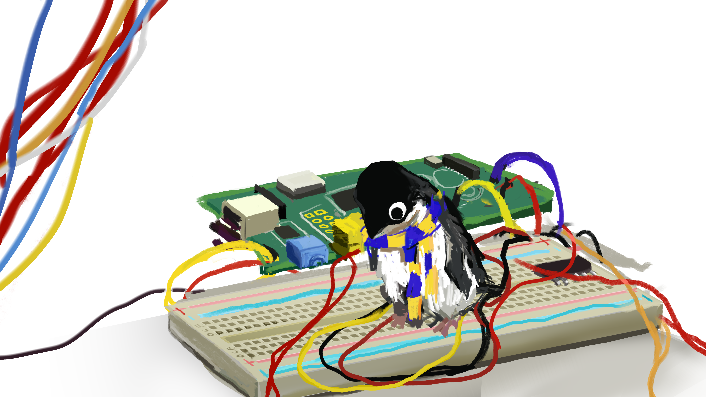

# 3 | 2/5/25

Attendance:

* lukepeters!
* ronitnath!
* storce!
* jedakrisnell!
* ncostello!
* laksith!
* adi
* rsang
* fengyihuang!
* jaysa!
* sawansri
* lic
* kinn
* jingwenyang!
* lemurseven!
* adymchenko
* erdaifuu
* oliverni
* tabi!
* aly
* jingwenyang
* rjz
* joiew
* danliu

\
Guests:

* marinabsant
* tiffanieguichard
* cfydify
* leos
* toke
* pebbles (finwan)\n

Start time: 6:12

Note taker: xxx

## <prevoting-hook>

### Finance

* Jaysa: is mfing chillin
  * Latest projects for our finances
  * <https://docs.google.com/spreadsheets/d/1dwmW80S-OTrySO1gFDyyNq-W3Z1AZqqkxQsZDTK8CG8/edit?gid=667448521#gid=667448521>
  * still need to do selenium script but focused on integrating ficomm into ocf rn lol

## Voting

For whichever matters we are required to vote on

Nominate Knives and Toke to BoD

[Buysheet](https://ocf.io/buysheet)

* Monitors
  * KVM Switch (2 monitor) - 98.99 x 1
  * ~~KVM Switch Matrix (1 monitor) - 79.99 x 3~~
    * buy only 1 for testing on opstaff desk
* Supplies
  * Batteries (Double AA and Triple AAA) - 28.78
    * Only for the OCF, no personal uses! 
  * Cat thumb tacks -7.99
  * Cord Organizer (pack of 5) - 7.99
  * All above: passed

    \
  * Ikea KALLAX Shelf - 79.99
    * Double stacked on all books and need more space :books:
    * Put shelf on the other side of the OCF
    * Shelf: passed

      \
  * Routine:
    * Envelopes - 17.95
    * 250 manilla folder - 36.99
    * Paper: $400
    * Passed, looking into borrowing ASUC credit card
* Staff benefit/decor
  * Umbrella (pack of 6) - 31.99
    * Too much rain, buy more
    * We will lose very quickily
    * Stricken
  * [Shadow the Hedgehog Duck](https://www.amazon.com/TUBBZ-Shadow-Collectible-Rubber-Figure/dp/B0CRS488SX/138-8386490-2381226?pd_rd_w=AHeN3&content-id=amzn1.sym.fc475966-e837-48fc-9ed0-f4ca6ae9337b&pf_rd_p=fc475966-e837-48fc-9ed0-f4ca6ae9337b&pf_rd_r=5RFFDVZJYQNS2PHGRJQW&pd_rd_wg=zTstF&pd_rd_r=06065f9c-4c11-4d35-a4e9-d452acf6e765&pd_rd_i=B0CRS488SX&th=1) - 17.91
  * BANG! Board Game - 19.99
    * Cool game :game_die:
    * let's go 
  * Passed except for umbrella
* Hanging Shelf (set of 2) - 33
  * deffered

* Opstaff hours issue
  * Jeda: Most Opstaff agree about there not being enough hours
    * Can't provide enough hours because of decal and bod, $80 per week loss
    * Projects do not work because of the administrative overhead
    * Ronit: work from home hours do not qualify for CACSSF (aka project hours)
    * Unable to pay Opstaff the full number of hours: no money :money_with_wings:
    * I saw the [Opstaff Projects](https://docs.ocf.berkeley.edu/doc/opstaff-projects-P6fIiRH3QN) page 
    * Nothing passed b/c funding situation
    * Oliver: change job description for op staff: no guarantee for hours
      * Hiring technical people for opstaff could also benefit the OCF
    * A lot of technical staff are open to fulfill opstaff hours

\
## Agreement

For initiatives you want bod's feedback on

* laksith: Move decal from XCF to OCF github organization (& formal transition?)
  * i agree -lemurseven
  * all decal repo belong to XCF currently. Should move to OCF
  * approved

* ronitnath: 
  * OCF Bylaws/Constitution updates
    * Add 2-bod attendance requirement for nomination to bylaws
      * Currently not in the bylaws
      * Oliver: bylaw should not exist
        * It isn't used in practice
        * Will talk async and talk next bod
    * Add missing 2-consecutive meetings as removal qualification
    * Remove language regarding deputy SM
      * Next bod
    * Add language 
* lemurseven:
  * harbor → ghcr, jenkins → gha (less pressing)
    * lemurseven will work on it
* jaysa/ronitnath:
  * supporting SSTF

## Notification

For keeping others up to date with what's happening and what you're doing

### Opstaff

* Jeda
  * First pay period is this weekend
    * Will be higher because of the "soft opening" during the first week of school
    * Without taking into account the soft opening, the semester estimate is around $24840.50
  * The tri-monitor setup is fine LMAO
    * [Front Desk Arrangement](https://docs.ocf.berkeley.edu/doc/front-desk-space-arrangement-CHZkytiIut)
  * [Opstaff Training](https://docs.ocf.berkeley.edu/doc/opstaff-training-uIdOhMpvlk)
    * Still checking Cal IDs?
* ronitnath
  * Hiring this semester: [Opstaff Hiring](/doc/opstaff-hiring-t7b5OCMzG0)
    * Hours
    * Projects
    * Shift time

### Internal

Joie/Luke

* Retreat
  * 2/21-2/23
  * Options:
  * Garberville
  * Sierra Nat'l
  * Yosemite
  * Pacifica

### Projects

* ronitnath: who is interested in these
  * Kubernetes
  * Nixos
  * HPC-LLM
  * Outreach
  * Home Depot
  * Headshots
  * Frontend
  * Marketing

### Marketing

jingwenyang: white t shirt with this? (still in progress)

btw sticker pretty pls :( only got one

 

### Decal

* sawansri
  * Regular Track
    * 30 enrolled but this number will go down
      * people have time conflicts, not sure if enrollment codes are one-time use only
      * need to test whether people can enroll with a code that's been used by a dropped student
    * First lecture was on Tuesday, 18 people showed up :(
    * Thoughts on making decal attendance mandatory (start docking points for missing lab/lecture)
      * I'm leaning towards yes
    * Will work on provisioning VMs after BoD
    * All 40 students added to Ed and Gradescope 
  * Experimental
    * 10 enrolled