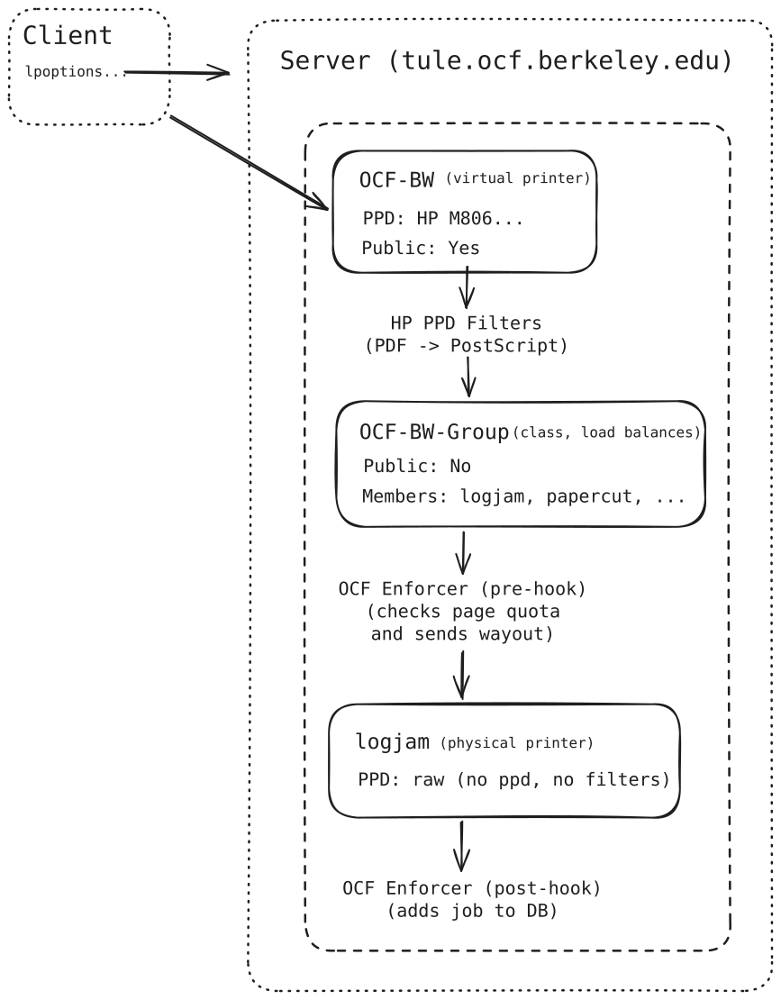

## Introduction

The OCF's print server is based around two components: [CUPS][cups], the
standard UNIX print server, and a custom print accounting system contained in
the ocflib API. CUPS is responsible for receiving print jobs over the network,
converting documents to a printer-friendly format, and delivering processed
jobs to one of the available printers. The OCF's print accounting system,
nicknamed enforcer after one of the scripts, plugs into CUPS as a driver that
intercepts jobs before and after going to the printer. It records jobs in a
database that keeps track of how many pages each user has printed, rejecting
jobs that go over quota. The high level flow of data through the print system
looks like this:

## Printing Pipeline


[cups]: https://openprinting.github.io/cups/


## CUPS pipeline overview

The first stage of printing is handled by the application that sends the print
job, such as Firefox. The application opens up a system print dialog, which gets
a list of available printers and options from printhost. The application renders
the desired pages to a PostScript, PDF, or other CUPS-compatible format, then sends
it to the printhost.

The CUPS server on the printhost receives the job and print options and queues
the job for printing. The actual document, plus metadata including user-set
options, is stored in the print spool at `/var/spool/cups` until a printer
becomes available to print it. The document is converted into a more
printer-friendly format before it actually reaches the printer. Once it's ready
to print, it is sent to the printer via some backend such as IPP.

Finally, the printer accepts a PostScript document as raw data and prints it
out (some also support raster formats). This part of the process is largely
controlled by the printer's onboard configuration, which can be modified by
visiting the printer's IP over the web (e.g. `https://papercut/`). In the OCF's
case, security is provided by an access control list (ACL) which accepts print
jobs from the printhost and rejects jobs from other hosts.


### Filters

CUPS handles documents of many different formats. Some typical MIME types
include `application/pdf` for raw PDF and `application/vnd.cups-postscript` for
printable PostScript. To convert between formats, CUPS runs the data through
programs called _filters_. A filter is, basically, a program that takes a
special call format, plus CUPS-specific environment variables, and converts
files from one format to another while adding special formatting options like
duplex mode.

CUPS uses not just one, but potentially several filters to get the document
into its final format. For example, a PDF file might go through `pdftops` to
convert it to PostScript, then `pstops` to insert print job options such as
duplexing, then, finally, a device-specific filter such as `hpcups`. Each
filter is associated with an internal "cost", and CUPS picks the path with the
least total cost to print the document.

We used to use ocfps as the filter for all documents. We use the stock
HP PPD drivers which use a combo of multiple filters, such as `hpps` and `pdftops`.


### Drivers

In order to know what job options are available for a particular printer and
how to convert documents to a printable format, CUPS requires large config
files called PostScript Printer Drivers (PPDs). The OCF uses the stock HP PPD's
for our printers and we have the user select double/single-sided on the client
print dialog. (as opposed to the double/single classes we used to have)


## Print accounting

The OCF used to use a virtual CUPS printer backend called [Tea4CUPS][Tea4CUPS] to
install a page accounting hook that runs before and after each job is actually
sent to the printer. Tea4CUPS is no longer maintained so we wrote a script that
implements the same api called [ocf-cups-backend][ocf-cups-backend]. The
[enforcer][enforcer] script actually holds the pre and post-hook logic, as well
as in the [ocflib printing package][ocflib.printing]. All jobs
are logged in the `ocfprinting` SQL database, including the username, print
queue, and number of pages. Several views count up the number of pages printed
by each user per day and per semester. Sensitive data like document titles are
removed from the database after 2 weeks. (see [enforcer][enforcer] for more details)

Page counting is actually done when the document is converted to PostScript,
since CUPS-processed PostScript includes the page count as a comment near the
top or bottom of the file. When enforcer receives a job that would put the user
over daily or semesterly quota, it emails the user and returns an error code
that cancels the job. Otherwise, it logs successful print jobs in the database
and emails users in the case a job fails.

[Tea4CUPS]: https://wiki.debian.org/Tea4CUPS
[enforcer]: https://github.com/ocf/nix/blob/main/modules/printhost/scripts/enforcer.py
[ocflib.printing]: https://github.com/ocf/ocflib/tree/master/ocflib/printing
[ocf-cups-backend]: https://github.com/ocf/nix/blob/main/modules/printhost/scripts/ocf-cups-backend


### Desktop notifications

After printing a document from a desktop, lab visitors are notified when their
print is sent to a printer (and which printer it was sent to) by a desktop
notification. The enforcer script sends a request for [wayout][wayout] to
notify the user.

[wayout]: https://github.com/ocf/wayout

## More Details

Please see the [printhost migration PR][printhost-pr] for more details on this new printing system.

[printhost-pr]: https://github.com/ocf/nix/pull/240

## History

### Old Pipeline
```
   [Application]
         +
         | PDF or PS document
         v
[Print spool (CUPS)]
         +
         | Raw document
         v
[Filter(s) (ocfps)]
         +
         | Converted PS document
         v
[Backend (Tea4CUPS)]
         +
         |  Accept or reject
         +<------------------+[Page counter (enforcer)]
         |                               ^
         v                               |
     [Printer]                           |                 Remaining quota
         +                               +-------+/      \<---------------+/             \
         | Status/completion time                 |ocflib|                 |Jobs database|
         v                               +------->\      /+--------------->\             /
     [Backend]                           |                 Job table entry
         +                               |
         |                               +
         +---------------------->[Enforcer (again)]
         |  Log success/failure
         v
[Print spool logger]
```

## Print accounting

The OCF uses a virtual CUPS printer backend called [Tea4CUPS][Tea4CUPS] to
install a page accounting hook that runs before and after each job is actually
sent to the printer. The script is called [enforcer][enforcer], but all the
logic is contained in the [ocflib printing package][ocflib.printing]. All jobs
are logged in the `ocfprinting` SQL database, including the username, print
queue, and number of pages. Several views count up the number of pages printed
by each user per day and per semester.

Page counting is actually done when the document is converted to PostScript,
since CUPS-processed PostScript includes the page count as a comment near the
top or bottom of the file. When enforcer receives a job that would put the user
over daily or semesterly quota, it emails the user and returns an error code
that cancels the job. Otherwise, it logs successful print jobs in the database
and emails users in the case a job fails.

[Tea4CUPS]: https://wiki.debian.org/Tea4CUPS
[enforcer]: https://github.com/ocf/puppet/blob/master/modules/ocf_printhost/files/enforcer
[ocflib.printing]: https://github.com/ocf/ocflib/tree/master/ocflib/printing


### Desktop notifications

After printing a document from a desktop, lab visitors are notified when pages
are subtracted from their quota by a little popup notification. This is done by
a short daemon script, [notify script][notify], which starts upon login and
runs the [paper command](../scripts/paper.md) every minute to see if the
quota has changed.

In the future, it would be nice to have a more robust notification system where
enforcer pushes notifications to desktops while a job is printing. This would
allow for richer notifications to be displayed; namely, alerts to show when
a job has started or finished printing, whether the job printed successfully,
and whether it went over quota. Current thinking is that this could be
implemented by broadcasting notifications to the whole network, or just the
desktops, and modifying the notify script to listen for messages about the
current user.

[notify]: https://github.com/ocf/puppet/blob/master/modules/ocf_desktop/files/xsession/notify


## See also

- [Printing maintenance](../procedures/printing.md)
- The [ocf\_printhost][ocf_printhost] Puppet class                      # TODO update
- The [paper](../scripts/paper.md) command
- [CUPS documentation at Samba][cups-samba] (for Windows users, but has general
  CUPS info as well)

[ocf_printhost]: https://github.com/ocf/puppet/tree/master/modules/ocf_printhost
[cups-samba]: https://www.samba.org/samba/docs/man/Samba-HOWTO-Collection/CUPS-printing.html
